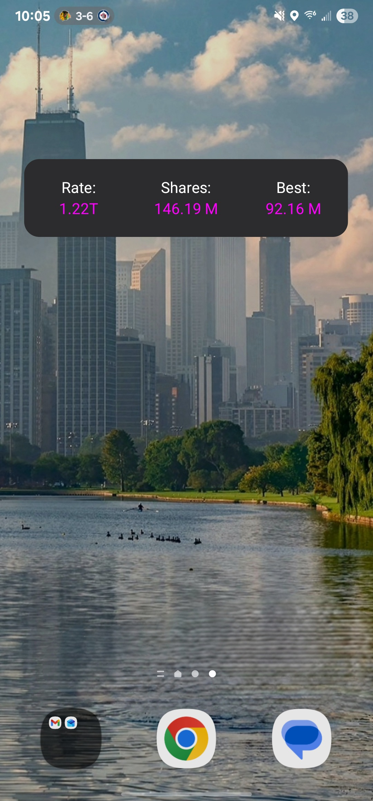

# Solo Mining Stats Widget

An Android home screen widget that displays real-time mining statistics from CKPool.


*Clean, compact display of your mining stats*

## Features

**Real-time Stats Display**
- Hashrate (uses 5m hashrate)
- Total shares
- Best difficulty ever achieved (stored locally and only updates if surpassed)

**Updates**
- Auto-updates every 30 minutes
- Tap anywhere on the widget to manually refresh
- "Best" value only increases, never decreases (persists even if CKPool resets)

**Customization**
-Change text color by opening app and entering hex color codes (https://htmlcolorcodes.com/)

## Installation

### Option 1: Download APK (Easy)

1. Go to [Releases](../../releases)
2. Download the latest `axe_watch.apk`
3. On your Android device, enable "Install from Unknown Sources":
   - Settings → Security → Unknown Sources (enable)
   - Or Settings → Apps → Special Access → Install Unknown Apps
4. Open the downloaded APK file and install
5. Open the "Axe Watch" app
6. Enter your Bitcoin address
7. Tap "Save Address"
8. Long-press on your home screen → Widgets → Find "Axe Watch"
9. Add to your home screen

### Option 2: Build from Source

**Requirements:**
- Android Studio
- Android SDK (API 24 or higher)
- Java Development Kit

**Steps:**
1. Clone this repository:
```bash
   git clone https://github.com/gitbr80/axe-watch.git
```
2. Open the project in Android Studio
3. Let Gradle sync and download dependencies
4. Connect your Android device
5. Click the green "Run" button
6. The app will install automatically

## Widget Display

The widget shows three main stats in a horizontal layout:
```
Rate:        Shares:       Best:
1.53T        120.31 M      68.76 M
```

Numbers are automatically formatted with units (k, M, G, T).

## Technical Details

- **Minimum Android Version**: Android 7.0 (API 24)
- **Update Frequency**: 30 minutes (Android minimum for widgets)
- **Data Source**: solo.ckpool.org API
- **Storage**: SharedPreferences (permanent local storage)
- **Permissions**: Internet access only

## Privacy

- Your Bitcoin address is stored locally on your device only
- No data is sent anywhere except to CKPool to fetch your stats
- No analytics, tracking, or ads

## Troubleshooting

**Widget shows "Open App Setup":**
- Open the app and enter your Bitcoin address

**Widget shows "Error":**
- Check your internet connection
- Verify your Bitcoin address is correct
- Tap the widget to retry

**Widget not updating:**
- Android may restrict background updates to save battery
- Go to Settings → Apps → Axe Watch → Battery → Set to "Unrestricted"
- Tap the widget to manually refresh anytime

**Can't resize widget:**
- Some launchers restrict widget sizes
- Try a different launcher (Nova Launcher, Lawnchair, etc.)

**Best value reset:**
- This shouldn't happen! The best value is saved permanently
- Only uninstalling the app will clear it


## Building Your Own

This widget was created for solo miners using CKPool's solo mining pool. If you want to adapt it for other pools or miners:

1. Fork this repository
2. Modify the API endpoint in `CKPoolWidget.java`
3. Adjust the JSON parsing to match your pool's API
4. Customize the display fields as needed

## Contributing

Contributions welcome! Feel free to:
- Report bugs
- Suggest features
- Share improvements

## License

MIT License - feel free to use, modify, and distribute!

## Credits

- Designed using Claude on Sonnet 4.5

## Support

Found this useful? Consider:
- Starring this repository
- Sharing with others
- Reporting bugs or requesting features

---

**Happy Mining!**
